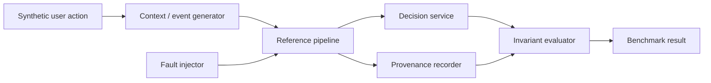

# IntentTrace Reference Architecture

**Status:** design draft. Updated as the reference implementation and benchmark results evolve.

## Purpose

IntentTrace studies information-integrity failures in distributed personalization, recommendation, and AI-enabled systems: cases where services remain available and responsive while a decision is produced from stale, missing, delayed, duplicated, conflicting, or incompatible information.

The reference architecture is intentionally small, synthetic, and deterministic so that failure scenarios can be reproduced from a clean checkout without proprietary infrastructure or data.

## Design principles

1. **Invariant first.** Every scenario starts with a correctness invariant that can be mechanically checked.
2. **Deterministic injection.** Faults use explicit configuration and seeds so the same scenario can be replayed.
3. **Decision-level provenance.** A result records the contextual inputs, versions, timing, and transformations that produced it.
4. **Synthetic and clean-room.** Workloads, reference components, and scenarios are independently constructed from public concepts.
5. **Framework neutral.** The core benchmark model should not depend on a commercial personalization or AI provider.
6. **Reproducible by default.** A clean checkout should be enough to run the reference scenarios.

## Logical flow

## Planned components

### `generator/`
Produces deterministic synthetic users, context versions, events, timestamps, and scenario inputs.

### `pipeline/`
Provides the clean-room reference path from generated context/events to a decision. The first implementation should remain intentionally simple so the failure mechanism is observable.

### `injectors/`
Contains one deterministic injector per supported failure class. An injector modifies the scenario state without changing the correctness invariant being evaluated.

### `provenance/`
Records the information used by the decision, including identifiers, versions, timestamps, transformations, degraded/fallback states, and outcome metadata needed for diagnosis.

### `benchmarks/`
Defines scenario configuration, expected invariants, execution harnesses, raw result formats, and reference results.

## Scenario contract

Every executable scenario must define:

- **Scenario ID** - stable machine-readable identifier for the scenario.
- **Failure class** - one canonical failure-class ID from
  [`failure-taxonomy.md`](failure-taxonomy.md).
- **Invariant** - the condition that must hold in a correct execution.
- **Control** - a healthy execution where the invariant holds.
- **Injection** - the deterministic change that creates the failure.
- **Decision boundary** - the point at which eligible context is evaluated for the decision.
- **Expected signature** - the observable evidence that the invariant was violated.
- **Detection rule** - how IntentTrace mechanically identifies the divergence.
- **Provenance requirements** - the minimum information needed to reconstruct the decision.
- **Reproduction metadata** - seed, configuration, environment, and source commit.

## Initial scenario: stale context

The first reference implementation targets the stale-context invariant already defined in [`failure-taxonomy.md`](failure-taxonomy.md):

> A decision reflects the most recent context committed before the decision point.

The scenario should create context `v1`, make it visible to the decision path, commit `v2`, deliberately hold the decision path on `v1`, and then record both the version used and the latest version available at decision time.

## Non-goals

The reference implementation is not intended to:

- reproduce any proprietary production architecture;
- benchmark or rank commercial AI/model providers;
- replace general availability, latency, or infrastructure monitoring;
- claim that a synthetic scenario proves the prevalence of the corresponding failure in production systems.

## Evolution

Architecture changes should be justified by a scenario, reproducibility requirement, or independently observed usability need. New components should not be added only to make the framework appear more complete.